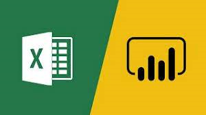

# Auto Replenishment Suggestion System
In development... I ask you to wait.

  - [**Description**](#description)
  - [**Before you run!**](#before-you-run)
  - [**Liability**](#liability)
  - [**Execution**](#execution)
  - [**Interactivity**](#interactivity)
  - [**Compatibility**](#compatibility)
  - [**Final considerations**](#final-considerations)


## **Description**


#### Auto Replenishment System for Retailers and Franchises integrated with MS-SQL and automated with DAX, M, and VBA and uses the Exponential Smoothing algorithm (ETS).

```
This project is for learning purposes and is available free of charge for anyone who wants to explore it.
All data contained in the project is artificially generated and complies with GDPR.
```

##### Introduction:

An auto-replenishment suggestion system is a type of automated system designed to manage and optimize inventory levels by providing recommendations for when and how much to reorder. This system is particularly valuable for businesses dealing with a variety of products and fluctuating demand. The goal is to maintain an efficient balance between avoiding stockouts (running out of inventory) and preventing overstocking.

##### Approach and Scope:

Here's how an auto-replenishment suggestion system typically works:

##### Data Collection:

The system collects historical data on product sales, stock levels, and other relevant factors.
Information about lead times (time taken from placing an order to receiving it) and supplier constraints may also be considered.

##### Forecasting:

The system employs forecasting methods, such as time series analysis or machine learning algorithms, to predict future demand for each product.
The forecasting models analyze patterns in historical data to estimate how much of each product is likely to be sold in the future.

##### Reorder Point Calculation:

Based on the demand forecasts and other factors, the system calculates a reorder point for each product.
The reorder point is the inventory level at which a new order should be placed to avoid running out of stock before the next order arrives.

##### Automatic Triggers:

When the actual stock level of a product falls below the calculated reorder point, the system automatically triggers a reorder.
Reorders can be initiated through automated purchase orders sent to suppliers or integrated with the company's procurement system.

##### Optimization:

The system may incorporate optimization algorithms to determine the optimal order quantity, considering factors like order costs, holding costs, and any quantity discounts offered by suppliers.

##### Monitoring and Adjustments:

The system continuously monitors actual sales, stock levels, and the performance of the forecasting models.
Periodically, the system adjusts its parameters and algorithms to adapt to changes in demand patterns or other relevant factors.


## **Before you run!**

```
☝ Although the author has tried to provide broad compatibility,
    this project is designed for the Windows environment with Office 365,
    and if you use it outside of that context, DAX, language M and Macros functions will not work.
```

```
🚫 Do not run this project file if you are unfamiliar with the subject.
```

```
🚫 Never run excel files from strangers without checking the code first!
    According to a study by cybersecurity firm Proofpoint,
    96% of phishing attacks that use malicious attachments use Excel files with macros.
    This means it is a significant risk that organizations must be aware of.
```

## **Liability**

This project required dozens of hours and results from the accumulation of years of experience, professional development, and self-learning. It is being shared free of charge for use, distribution, and study. I'm not responsible for anything. The entire project is provided as it is, and you can use it at your own risk.

## **Execution**

The project is divided into the main Excel file and files in the data subfolders. There are also connections to SQL databases. Direct execution of the Excel file solves all these complexities for you with all the integrated APIs.

If you just want to run the project, `download and unpack it` and then simply double-click on the excel file.


## **Interactivity**

The main file was developed to automate as much as possible the work of a Commercial Operations Analyst using several approaches simultaneously like VBA, DAX, SQL and M.

Profound changes to the project require Sales and Operations Planning (S&OP) knowledge and Data Analysis knowledge.


## **Compatibility**

This project was developed on the Windows platform with Office 365. Due to the need for intensive use of DAX and VBA content in the project, it was only compatible with the Windows environment at the time of publication.


## **Final considerations**

If you understand what you're doing, consider learning more about Sales and Operations Planning (S&OP), SQL, Power BI, DAX, M, R, and Python. I will warn you: the learning curve is long with ups and downs... Don't be discouraged.